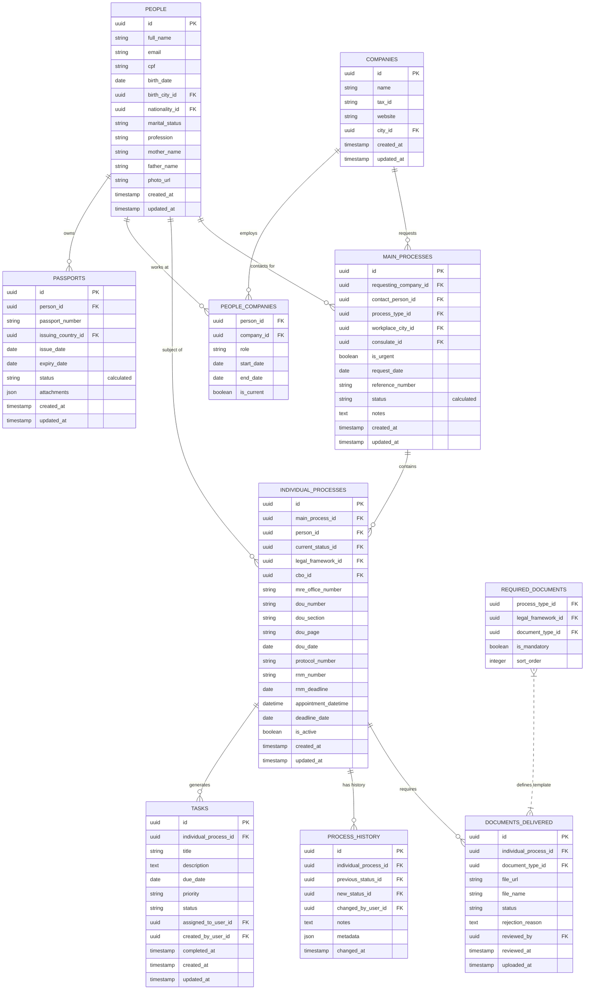
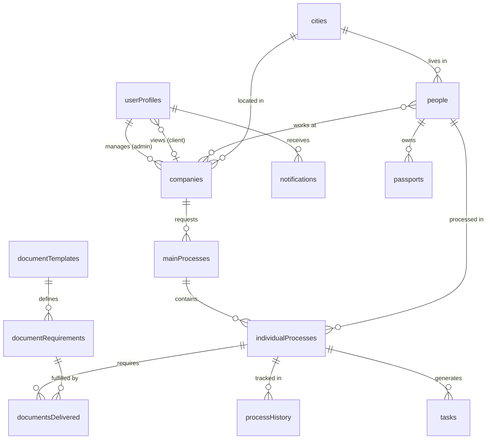

# PRD: Immigration Law Process Management System

## 1. Executive Summary

This document outlines the requirements for system platform designed for immigration law firms specializing in visa applications, passport services, and residence permits (RNM). The system's core innovation is its ability to manage complex collective processes while maintaining detailed individual tracking for each person within those processes.

### Key Innovation

The system treats "Processes" as containers that can hold multiple "Individual Processes." Each individual process tracks a specific person's journey through the immigration process, while the parent process provides a unified view and management interface.

## 2. Core Objectives

1. **Unified Process Management**: Create a hierarchical structure where main processes contain multiple individual processes, enabling both macro and micro-level management.

2. **Individual Journey Tracking**: Track each person's unique progress, documents, and status within a collective process.

3. **Document Automation**: Generate document requirement lists automatically based on process type and legal framework.

4. **Task and Deadline Management**: Automate task creation and deadline tracking for each individual's journey.

5. **Historical Transparency**: Maintain comprehensive audit trails for compliance and client communication.

## 3. System Architecture

### 3.1 Process Hierarchy

```
Main Process (Container)
├── Individual Process 1 (Person A)
├── Individual Process 2 (Person B)
├── Individual Process 3 (Person C)
└── ... (Additional individuals)
```

### 3.2 Core Modules

1. **Process Management Module**
   - Main process creation and overview
   - Individual process management within main processes
   - Bulk operations for collective processes

2. **People & Companies Module (CRM)**
   - Candidate profile management
   - Company client management
   - Relationship mapping

3. **Progress Tracking Module**
   - Individual status tracking
   - Document verification workflow
   - Government protocol management

4. **Document Management Module**
   - Template-based requirement generation
   - Document upload and verification
   - Expiration tracking and alerts

5. **Task Management Module**
   - Automated task generation
   - Deadline management
   - Assignment and collaboration tools

6. **Support Data Module**
   - Brazilian CBO (Occupational Classification)
   - Consulate information
   - Geographic data with Federal Police presence

## 4. Database Schema

### 4.1 Entity Relationship Diagram



### 4.2 Core Tables Detailed

#### main_processes

**Purpose**: Container for collective or individual immigration cases. Users primarily interact with this level.

**Key Fields**:

- `reference_number`: Unique identifier for client reference
- `status`: Calculated field showing aggregate status of all individual processes
- `requesting_company_id`: The client company requesting the service
- `contact_person_id`: Primary contact at the requesting company

**Business Logic**:

- Status is dynamically calculated based on individual processes:
  - "In Preparation" if all individuals are in preparation
  - "In Progress" if any individual is in progress
  - "Completed" if all individuals are completed
  - "Mixed" with breakdown (e.g., "3 Approved, 2 In Progress, 1 Pending")

#### individual_processes

**Purpose**: Tracks each person's specific journey within a main process.

**Key Fields**:

- `main_process_id`: Links to parent process
- `person_id`: The individual being processed
- `current_status_id`: Current stage in the immigration process
- `legal_framework_id`: Legal basis for the application
- Protocol numbers, government references, and deadlines

**Business Logic**:

- Each status change triggers history recording
- Document requirements auto-generate based on `process_type_id` + `legal_framework_id`
- Tasks auto-generate at status transitions

#### documents_delivered

**Purpose**: Manages document submissions with version control and review workflow.

**Key Features**:

- Review workflow with approval/rejection
- Rejection reasons for client communication
- File versioning through multiple uploads
- Status tracking: "Pending Review", "Approved", "Rejected", "Re-submitted"

### 4.3 Support Tables

#### Lookup Tables

- `process_types`: Visa types, RNM, Passport renewal, etc.
- `legal_frameworks`: Legal basis for applications
- `document_types`: Passport copy, Work contract, etc.
- `process_statuses`: Preparation, Submitted, Under Review, Approved, etc.
- `cbo`: Brazilian Occupational Classification
- `countries`, `states`, `cities`: Geographic data with Federal Police locations
- `consulates`: Consulate locations and contact information
- `users`: System users (lawyers, paralegals, admins)

## 5. Key Features and User Flows

### 5.1 Process Creation Flow

1. **Main Process Creation**
   - Select requesting company and process type
   - Define workplace location and consulate
   - Set urgency and add notes
   - System generates unique reference number

2. **Adding Individuals**
   - Add people to main process (individually or bulk import)
   - For each person, system creates an individual_process record
   - Auto-generates document checklist based on process type + legal framework
   - Creates initial tasks with deadlines

### 5.2 Document Management Flow

1. **Requirement Generation**
   - System queries `required_documents` table
   - Creates `documents_delivered` records with "Pending" status
   - Displays checklist to user

2. **Upload and Review**
   - Users upload documents against requirements
   - Reviewers approve/reject with comments
   - Rejected documents allow re-submission
   - System tracks all versions

### 5.3 Status Tracking

1. **Individual Level**
   - Each person has independent status
   - Status changes log to history
   - Automatic notifications on critical changes

2. **Process Level View**
   - Dashboard shows all individuals in a process
   - Visual indicators for status distribution
   - Bulk operations for common actions

### 5.4 Smart Features

#### Passport Expiration Management

```sql
-- Calculated status based on expiry date
CASE
  WHEN expiry_date < CURRENT_DATE THEN 'Expired'
  WHEN expiry_date < CURRENT_DATE + INTERVAL '6 months' THEN 'Expiring Soon'
  ELSE 'Valid'
END as passport_status
```

#### Document Template System

- Templates defined by process type + legal framework combination
- Supports conditional requirements
- Customizable per client company

#### Task Automation

- Status transitions trigger task creation
- Deadline calculation based on government SLAs
- Assignment rules based on workload and expertise

## 6. Technical Implementation Considerations

### 6.1 Performance Optimizations

- Indexes on frequently queried fields
- Materialized views for complex status calculations
- Async processing for document generation
- CDN for document storage

### 6.2 Security Requirements

- Row-level security for multi-tenant isolation
- Encryption at rest for sensitive documents
- Audit logging for compliance
- Role-based access control

### 6.3 Integration Points

- Government APIs for protocol verification
- Document generation services
- Email/SMS notification systems
- Calendar integration for appointments

## 7. User Interface Concepts

### 7.1 Main Process View

```
┌─────────────────────────────────────────────┐
│ Process: ACME Corp - Work Visas 2024        │
│ Reference: WV-2024-001                      │
│ Status: 3 Approved, 2 In Progress, 1 Pending│
├─────────────────────────────────────────────┤
│ Individual Processes:                       │
│ ┌─────────────────────────────────────────┐ │
│ │ ✓ John Smith    - Approved  - RNM Ready│ │
│ │ ⟳ Jane Doe      - In Review - MRE Wait │ │
│ │ ⟳ Bob Johnson   - Submitted - Day 5/30  │ │
│ │ ○ Alice Brown   - Preparing - 3 docs left│ │
│ │ ✓ Charlie Davis - Approved  - Complete  │ │
│ │ ✓ Eve Wilson    - Approved  - RNM Ready│ │
│ └─────────────────────────────────────────┘ │
└─────────────────────────────────────────────┘
```

### 7.2 Individual Process Detail

- Timeline view of status changes
- Document checklist with upload interface
- Task list with deadlines
- Communication history
- Government protocol tracking

## 8. Success Metrics

1. **Process Efficiency**
   - 50% reduction in document preparation time
   - 80% first-time approval rate
   - 30% faster overall process completion

2. **User Satisfaction**
   - Real-time status visibility
   - Reduced client inquiries
   - Improved team collaboration

3. **Compliance**
   - 100% audit trail coverage
   - Zero missed deadlines
   - Complete document history

## 9. Implementation Roadmap

### Phase 1: Core System (Months 1-3)

- Database schema implementation
- Basic CRUD operations
- User authentication and authorization
- Main process and individual process management

### Phase 2: Document Management (Months 4-5)

- Document upload and storage
- Review workflow
- Template system
- Expiration tracking

### Phase 3: Automation (Months 6-7)

- Task generation
- Status calculations
- Notification system
- Deadline management

### Phase 4: Advanced Features (Months 8-9)

- Government API integrations
- Advanced reporting
- Bulk operations
- Mobile app

### Phase 5: Optimization (Months 10-12)

- Performance tuning
- Advanced analytics
- AI-powered insights
- Process optimization recommendations

## 10. Convex Database Implementation

### 10.1 User Roles and Permissions

The system implements a simplified two-role access control system designed for a single law firm serving multiple client companies:

#### Role Hierarchy

1. **Admin** - Law Firm Staff (Full System Access)
   - Full CRUD access to all entities (companies, people, processes, documents)
   - Create and manage main processes and individual processes
   - Upload and review documents
   - Update process statuses and manage workflows
   - Manage user profiles and assign roles
   - Configure lookup tables (countries, cities, process types, etc.)
   - View all data across all client companies
   - Access admin dashboard with analytics
   - Manage document templates and requirements

2. **Client** - Company Representatives (Read-Only, Company-Scoped Access)
   - View only their own company's data
   - Read-only access to:
     - Their company profile
     - People associated with their company
     - Main processes for their company
     - Individual processes for their company's people
     - Documents related to their company or people
     - Passports of their company's people
     - Employment history for their company
   - Cannot create, update, or delete any entities
   - Cannot modify lookup tables
   - Access limited to their assigned company only

### 10.2 Process Management Workflow

The system implements a streamlined process management workflow for the single law firm:

#### Process Creation and Management Flow

1. **Process Initiation** (Admin Only)
   - Admin staff create `mainProcesses` directly
   - Specify company, process type, and urgency
   - Add multiple candidates to one process
   - No approval workflow needed (internal law firm operation)

2. **Process Tracking**
   - System creates `individualProcesses` for each candidate
   - Document requirements auto-generate from templates
   - Initial tasks created with deadlines
   - Client users can view progress in real-time

3. **Client Portal Access** (Read-Only)
   - Client users log in to view their company's processes
   - See status updates for all their candidates
   - View required documents and current progress
   - Receive notifications on status changes
   - Cannot create, modify, or delete processes

### 10.3 Document Template Management

The admin-controlled document template system ensures consistency and compliance:

#### Template Structure

```typescript
documentTemplates -> documentRequirements -> documentsDelivered
```

#### Key Features

1. **Template Creation** (Admin only)
   - Define templates per process type
   - Specify required vs optional documents
   - Mark critical documents that block progress
   - Set validity periods for time-sensitive docs

2. **Requirement Configuration**
   - File size limits and format restrictions
   - Translation and notarization requirements
   - Example documents for candidate reference
   - Sort order for logical document collection

3. **Smart Document Tracking**
   - Version control for resubmissions
   - Expiration monitoring with alerts
   - Review workflow with rejection reasons
   - Progress indicators showing what's missing

### 10.4 Complete Convex Database Schema

#### Database Schema Overview



#### User Tables

##### userProfiles

User profiles with simplified two-role access control system.

```typescript
{
  userId: Id<"users">        // Link to Convex auth user
  email: string              // User email (unique)
  fullName: string           // Display name
  role: "admin" | "client"   // Only two roles
  companyId?: Id<"companies"> // For client users only (null for admins)
  phoneNumber?: string       // Contact phone
  photoUrl?: string          // Profile photo
  isActive: boolean          // Account status
  createdAt: number          // Account creation
  updatedAt: number          // Last profile update
}
```

**Access Control Logic**:
- **Admin users**: `role === "admin"` and `companyId === undefined`
  - Full CRUD access to all entities across all companies
  - Can create, update, delete any record
  - Can manage all lookup tables

- **Client users**: `role === "client"` and `companyId !== undefined`
  - Read-only access filtered by their `companyId`
  - Can view only data related to their assigned company
  - Cannot create, update, or delete any records

#### Client and People Tables

##### companies

Client companies that request immigration services from the law firm.

```typescript
{
  name: string                         // Company name
  taxId: string                        // CNPJ or tax ID
  website?: string                     // Company website
  address: string                      // Company address
  cityId: Id<"cities">                 // Location
  phoneNumber: string                  // Contact phone
  email: string                        // Contact email
  contactPersonId?: Id<"people">       // Primary contact
  isActive: boolean                    // Active client
  notes?: string                       // Internal notes
  createdAt: number                    // Creation timestamp
  updatedAt: number                    // Last update
  createdBy: Id<"users">               // Created by admin user
}
```

**Access Control**:
- Admin users: Full CRUD access to all companies
- Client users: Read-only access to their assigned company only (via `userProfiles.companyId`)

##### people

Individuals (candidates) being processed for immigration services.

```typescript
{
  fullName: string                     // Complete name
  email: string                        // Email address
  cpf?: string                         // Brazilian CPF
  birthDate: string                    // ISO date (YYYY-MM-DD)
  birthCityId: Id<"cities">            // Birth location
  nationalityId: Id<"countries">       // Nationality
  maritalStatus: string                // Single/Married/Divorced
  profession: string                   // Job title
  motherName: string                   // Mother's full name
  fatherName: string                   // Father's full name
  phoneNumber: string                  // Contact phone
  address: string                      // Current address
  currentCityId: Id<"cities">          // Current location
  photoUrl?: string                    // Profile photo
  notes?: string                       // Internal notes
  createdAt: number                    // Creation timestamp
  updatedAt: number                    // Last update
  createdBy: Id<"users">               // Created by admin user
}
```

**Access Control**:
- Admin users: Full CRUD access to all people
- Client users: Read-only access to people associated with their company (via `peopleCompanies` junction table)

#### Process Management Tables

##### mainProcesses

Container for one or more individual immigration processes. Created directly by admin staff.

```typescript
{
  referenceNumber: string              // Unique reference (e.g., WV-2024-001)
  companyId: Id<"companies">           // Client company
  contactPersonId: Id<"people">        // Company contact
  processTypeId: Id<"processTypes">    // Process type
  workplaceCityId: Id<"cities">        // Where person will work
  consulateId?: Id<"consulates">       // Processing consulate
  isUrgent: boolean                    // Priority flag
  requestDate: string                  // ISO date
  managerId: Id<"users">               // Responsible admin/manager
  notes?: string                       // Process notes
  status: "draft" | "in_progress" | "completed" | "cancelled"
  completedAt?: number                 // Completion timestamp
  createdAt: number                    // Creation timestamp
  updatedAt: number                    // Last update
  createdBy: Id<"users">               // Created by admin user
}
```

**Access Control**:
- Admin users: Full CRUD access to all main processes
- Client users: Read-only access to processes for their company only (filtered by `companyId`)

##### individualProcesses

Tracks each person's journey within a main process.

```typescript
{
  mainProcessId: Id<"mainProcesses">   // Parent process
  personId: Id<"people">               // Person being processed
  status: "pending_documents" | "documents_submitted" | "documents_approved" | "preparing_submission" | "submitted_to_government" | "under_government_review" | "government_approved" | "government_rejected" | "completed" | "cancelled"
  legalFrameworkId: Id<"legalFrameworks">  // Legal basis
  cboId?: Id<"cboCodes">               // Occupation code
  mreOfficeNumber?: string             // Ministry reference
  douNumber?: string                   // Official gazette number
  douSection?: string                  // Gazette section
  douPage?: string                     // Gazette page
  douDate?: string                     // Publication date
  protocolNumber?: string              // Government protocol
  rnmNumber?: string                   // Residence card number
  rnmDeadline?: string                 // RNM expiry date
  appointmentDateTime?: string         // Scheduled appointment
  deadlineDate?: string                // Process deadline
  isActive: boolean                    // Active process
  completedAt?: number                 // Completion timestamp
  createdAt: number                    // Creation timestamp
  updatedAt: number                    // Last update
}
```

**Access Control**:
- Admin users: Full CRUD access to all individual processes
- Client users: Read-only access to individual processes for their company (filtered via `mainProcess.companyId`)

#### Document Management Tables

##### documentTemplates

Admin-created templates defining required documents per process type.

```typescript
{
  name: string                         // Template name
  description: string                  // Template description
  processTypeId: Id<"processTypes">    // Process type
  legalFrameworkId?: Id<"legalFrameworks">  // Legal framework
  isActive: boolean                    // Active template
  version: number                      // Version number
  createdAt: number                    // Creation timestamp
  updatedAt: number                    // Last update
  createdBy: Id<"users">               // Created by admin
}
```

**Access Control**:
- Admin users: Full CRUD access to all templates
- Client users: Read-only access to view templates (for understanding requirements)

##### documentRequirements

Specific document requirements within a template.

```typescript
{
  templateId: Id<"documentTemplates">  // Parent template
  documentTypeId: Id<"documentTypes">  // Document type
  isRequired: boolean                  // Mandatory document
  isCritical: boolean                  // Blocks progress if missing
  description: string                  // Requirement details
  exampleUrl?: string                  // Example document
  maxSizeMB: number                    // Max file size
  allowedFormats: string[]             // [".pdf", ".jpg", ".png"]
  sortOrder: number                    // Display order
  validityDays?: number                // How long valid (e.g., 180)
  requiresTranslation: boolean         // Needs translation
  requiresNotarization: boolean        // Needs notarization
}
```

**Access Control**:
- Admin users: Full CRUD access
- Client users: Read-only access

##### documentsDelivered

Actual documents uploaded by users.

```typescript
{
  individualProcessId: Id<"individualProcesses">  // Process
  documentTypeId: Id<"documentTypes">             // Document type
  documentRequirementId?: Id<"documentRequirements">  // Requirement
  personId?: Id<"people">              // Person document belongs to
  companyId?: Id<"companies">          // Or company document belongs to
  fileName: string                     // Original filename
  fileUrl: string                      // Storage URL
  fileSize: number                     // Size in bytes
  mimeType: string                     // File type
  status: "not_started" | "pending_upload" | "uploaded" | "under_review" | "approved" | "rejected" | "expired"
  uploadedBy: Id<"users">              // Who uploaded
  uploadedAt: number                   // Upload timestamp
  reviewedBy?: Id<"users">             // Who reviewed
  reviewedAt?: number                  // Review timestamp
  rejectionReason?: string             // Why rejected
  expiryDate?: string                  // Document expiry
  version: number                      // Version number
  isLatest: boolean                    // Current version
}
```

**Access Control**:
- Admin users: Full CRUD access to all documents
- Client users: Read-only access to documents for their company (filtered via `companyId` or person's company through `peopleCompanies`)

#### Tracking and History Tables

##### processHistory

Complete audit trail of status changes.

```typescript
{
  individualProcessId: Id<"individualProcesses">  // Process
  previousStatus?: IndividualProcessStatus         // From status
  newStatus: IndividualProcessStatus               // To status
  changedBy: Id<"users">               // Who changed (admin)
  changedAt: number                    // When changed
  notes?: string                       // Change notes
  metadata?: any                       // Additional data
}
```

**Access Control**:
- Admin users: Full CRUD access
- Client users: Read-only access to history for their company's processes

##### tasks

Task management for processes.

```typescript
{
  individualProcessId?: Id<"individualProcesses">  // Related process
  mainProcessId?: Id<"mainProcesses">  // Related main process
  title: string                        // Task title
  description: string                  // Task details
  dueDate: string                      // ISO date
  priority: "low" | "medium" | "high" | "urgent"
  status: "todo" | "in_progress" | "completed" | "cancelled"
  assignedTo: Id<"users">              // Assigned admin user
  createdBy: Id<"users">               // Creator (admin)
  completedAt?: number                 // Completion timestamp
  completedBy?: Id<"users">            // Who completed (admin)
  createdAt: number                    // Creation timestamp
  updatedAt: number                    // Last update
}
```

**Access Control**:
- Admin users: Full CRUD access to all tasks
- Client users: Read-only access to tasks for their company's processes

##### notifications

User notification system.

```typescript
{
  userId: Id<"users">                  // Recipient
  type: string                         // Notification type
  title: string                        // Notification title
  message: string                      // Notification body
  entityType?: string                  // Related entity type
  entityId?: string                    // Related entity ID
  isRead: boolean                      // Read status
  readAt?: number                      // Read timestamp
  createdAt: number                    // Creation timestamp
}
```

**Access Control**:
- All users can view their own notifications
- Admin users can send notifications to client users

##### activityLogs

System-wide activity logging for audit and compliance.

```typescript
{
  userId: Id<"users">                  // Acting user
  action: string                       // Action performed
  entityType: string                   // Entity type
  entityId: string                     // Entity ID
  details?: any                        // Action details
  ipAddress?: string                   // User IP
  userAgent?: string                   // Browser info
  createdAt: number                    // Action timestamp
}
```

**Access Control**:
- Admin users: Full read access to all activity logs
- Client users: Read access to logs for their own actions only

#### Support Data Tables

##### passports

Passport information with expiration tracking.

```typescript
{
  personId: Id<"people">               // Owner
  passportNumber: string               // Passport number
  issuingCountryId: Id<"countries">   // Issuing country
  issueDate: string                    // Issue date
  expiryDate: string                   // Expiry date
  fileUrl?: string                     // Scanned copy
  isActive: boolean                    // Current passport
  createdAt: number                    // Creation timestamp
  updatedAt: number                    // Last update
}
```

**Access Control**:
- Admin users: Full CRUD access to all passports
- Client users: Read-only access to passports for people associated with their company (via `peopleCompanies`)

##### peopleCompanies

Many-to-many relationship between people and companies (employment/association).

```typescript
{
  personId: Id<"people">               // Person
  companyId: Id<"companies">           // Company
  role: string                         // Role/position
  startDate: string                    // Employment start
  endDate?: string                     // Employment end
  isCurrent: boolean                   // Currently employed
}
```

**Access Control**:
- Admin users: Full CRUD access to all relationships
- Client users: Read-only access to relationships for their company only

#### Lookup Tables

All lookup tables follow the same access control pattern:

**Access Control**:
- Admin users: Full CRUD access (can create, update, delete, reorder)
- Client users: Read-only access (needed for form dropdowns and reference data)

##### processTypes

```typescript
{
  name: string; // Process name
  code: string; // Unique code
  description: string; // Description
  category: string; // Category
  estimatedDays: number; // Expected duration
  isActive: boolean; // Available
  sortOrder: number; // Display order
}
```

##### legalFrameworks

```typescript
{
  name: string; // Framework name
  code: string; // Unique code
  description: string; // Description
  isActive: boolean; // Available
}
```

##### documentTypes

```typescript
{
  name: string; // Document name
  code: string; // Unique code
  category: string; // Category
  description: string; // Description
  isActive: boolean; // Available
}
```

##### cboCodes

Brazilian Occupational Classification.

```typescript
{
  code: string; // CBO code
  title: string; // Job title
  description: string; // Job description
}
```

##### countries

```typescript
{
  name: string; // Country name
  code: string; // ISO code (BR)
  iso3: string; // ISO3 code (BRA)
}
```

##### states

```typescript
{
  name: string; // State name
  code: string; // State code
  countryId: Id<"countries">; // Country
}
```

##### cities

```typescript
{
  name: string; // City name
  stateId: Id<"states">; // State
  hasFederalPolice: boolean; // Has PF office
}
```

##### consulates

```typescript
{
  name: string                         // Consulate name
  cityId: Id<"cities">                 // Location
  address: string                      // Full address
  phoneNumber: string                  // Contact phone
  email: string                        // Contact email
  website?: string                     // Website URL
}
```

#### Admin Configuration Tables

##### dashboardWidgets

User-specific dashboard customization.

```typescript
{
  userId: Id<"users">                  // User
  widgetType: string                   // Widget type
  position: {                          // Grid position
    x: number
    y: number
    w: number                          // Width
    h: number                          // Height
  }
  settings?: any                       // Widget settings
  isVisible: boolean                   // Show/hide
}
```

**Access Control**:
- All users can manage their own dashboard widgets
- Admin users can additionally view all users' widget configurations

##### systemSettings

System-wide configuration settings (admin only).

```typescript
{
  key: string                          // Setting key
  value: any                           // Setting value
  description: string                  // Setting description
  updatedBy: Id<"users">               // Last updater (admin)
  updatedAt: number                    // Update timestamp
}
```

**Access Control**:
- Admin users: Full CRUD access to all system settings
- Client users: Read-only access to public settings (e.g., company info)

### 10.5 Key Workflow Implementations

#### 1. Missing Documents Visibility

```typescript
// User can see what's missing through:
- documentRequirements (what's needed)
- documentsDelivered (what's been provided)
- Status indicators on each requirement
- Critical document flags that block progress
````

#### 2. Bulk Candidate Management

```typescript
// Manager can add multiple candidates by:
- Creating one mainProcess
- Adding multiple individualProcesses
- Each candidate tracks independently
- Bulk operations available for common actions
```

#### 3. Status Tracking

```typescript
// Multi-level status system:
- processRequests.status - Request approval workflow
- mainProcesses.status - Overall process status
- individualProcesses.status - Per-person progress
- documentsDelivered.status - Document review status
```

### 10.6 Security and Access Control

The system implements comprehensive security for a single law firm serving multiple client companies:

1. **Role-Based Access Control (Two Roles)**
   - **Admin**: Law firm staff with full system access
     - Complete CRUD operations on all entities
     - Access to all client companies' data
     - Can manage lookup tables and system configuration
   - **Client**: Company representatives with limited access
     - Read-only access filtered by their assigned `companyId`
     - Cannot create, update, or delete any records
     - Can only view data related to their company

2. **Company-Scoped Data Filtering**
   - Client users have `companyId` in their profile
   - All queries automatically filter by `companyId` for client users
   - Direct filtering: companies, mainProcesses
   - Relationship-based filtering: people (via peopleCompanies), individualProcesses (via mainProcess.companyId)
   - Document access: filtered by document's companyId or person's company

3. **Audit Trail**
   - `activityLogs` track all user actions
   - `processHistory` records all status changes
   - User ID and timestamp on all modifications
   - IP address and user agent logged for compliance

4. **Data Integrity**
   - Foreign key relationships enforced via Convex schema
   - Cascade rules for related data deletion
   - Version control on documents and templates
   - Referential integrity checks before deletion

5. **Authentication and Authorization**
   - Convex Auth for user authentication
   - Helper functions enforce authorization:
     - `getCurrentUserProfile()`: Get authenticated user's profile
     - `requireAdmin()`: Ensure user is admin, throw error otherwise
     - `canAccessCompany()`: Check if user can access specific company data
   - All mutations require admin role
   - All queries filter by user's access level

## 11. Conclusion

This comprehensive system combines the power of Convex's real-time database with a sophisticated immigration process management workflow designed for a single law firm serving multiple client companies. The simplified two-role access control ensures proper data governance while providing a seamless client portal experience.

Key innovations include:

- **Hierarchical process management** with individual tracking
- **Smart document templates** with progress visibility
- **Client portal** with read-only, company-scoped access for transparency
- **Streamlined workflow** optimized for single law firm operations
- **Real-time updates** leveraging Convex's reactive queries
- **Role-based access control** with admin/client separation
- **Company-scoped data filtering** for secure multi-client support

This platform will transform how the law firm operates, providing:
- **For law firm staff (admins)**: Complete control over all processes, clients, and data
- **For client companies**: Real-time visibility into their immigration processes with secure, read-only access
- **For both**: Improved transparency, efficiency, and compliance in one integrated system
